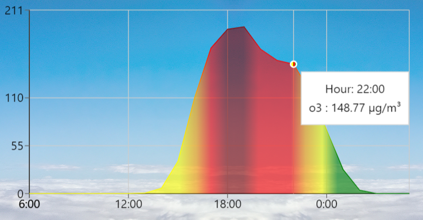

# React Air Quality Lookup

Visit the website at: https://quinnbooth.github.io/React-Air-Quality-Lookup/

This project was bootstrapped with [Create React App](https://github.com/facebook/create-react-app).

Data is sourced from the OpenWeather Air Pollution API along with geospatial information from simplemaps' World Cities Database.

An API proxy is hosted on the Deno Javascript Runtime to keep keys secure.

 

  
   

 

## Author

👨‍💻 **Quinn Booth** - `qab2004@columbia.edu`
  

## How to Use

First, visit the website above. Once there, scroll down and enter your city into the search bar. If it's in the database, air quality data for the next 24 hours will show up on the provided graphs!
  

# How it Works

Lorem ipsum dolor sit amet, pro ei sale corpora probatus. Cu pri inani oporteat scriptorem, ius legimus gubergren eu, mucius delicata ne sit. Eum dicit possim ut, et his falli quaeque, oratio putent commodo has id. Mel eu tota consetetur instructior, eu ponderum consequuntur cum, in sea ceteros definitionem.  

  
   

  
   

 

Putant quaerendum eam et, vide invidunt delicata mel ne, sit no ignota mucius similique. Eu sit errem percipit constituto, bonorum referrentur an vis. Sed et libris antiopam interesset, integre delenit pro ut, nec semper volutpat ad. Mei putent facilis vituperata ea. Perpetua postulant elaboraret vis ad, meis solum eam eu. Enim tritani argumentum est ei, te habeo mazim quo.

Quo in prima albucius sapientem, per tota maluisset in, eu has consul mediocrem torquatos. Exerci dicunt detracto at mel. Pri posse reformidans ad, id ius dolorem dignissim deterruisset. Vim nisl intellegam consequuntur ut, vix ne error possim. Dicunt diceret no eam, cu elitr oportere nec.